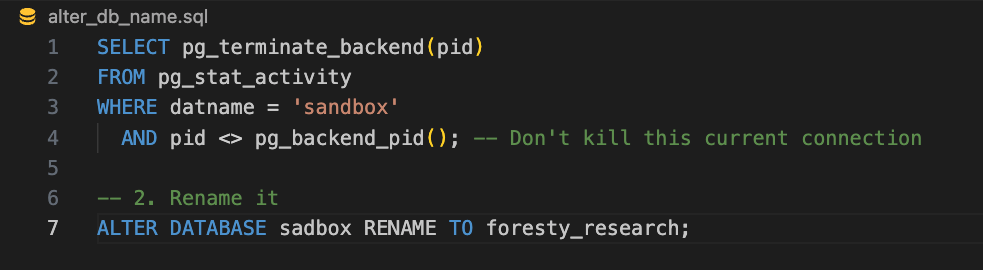
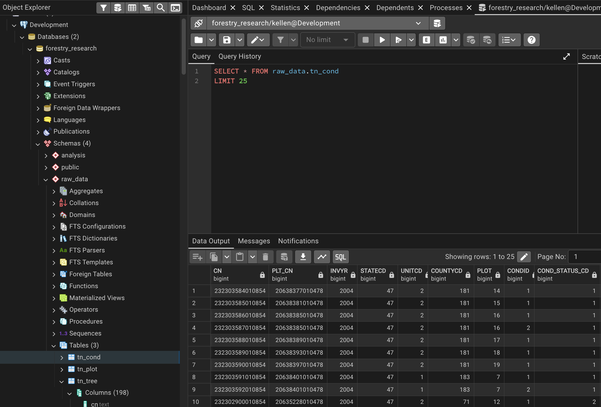

# Tennessee Forest Canopy Height: Spatial and Tabular ETL to Feed Machine Learning Model

> **Project Objective:** Create compatibility between ground survey forest data and satellite canopy height rasters to fuel a robust, ML-ready dataset for biomass modeling.

---

## Overview

This project addresses the gap between ground-level forestry inventory and high-resolution satellite height models. By joining thousands of tree-level measurements with spatial rasters, we are building a model to predict forest structure across the state of Tennessee. 

Sourcing and storing the raw data was critical to provide a solid foundation prior to performing any type of analysis. A database was created in PostgresSQL to house this information.

Tabular data was obtained from the Forest Inventory and Analysis DataMart provided by the U.S. Department of Agriculture. Information regarding the plot of land, condition of the land, and field surveys of trees were of particular interest to this query, so three applicable tables were downloaded from the FIA DataMart. A fourth table, containing the master list of tree species, would later be included from the same source. That raw data can be found here: [FIA DataMart](https://research.fs.usda.gov/products/dataandtools/fia-datamart)

To make a comparrison to remote sensing data and demonstrate competency working with raster data, canopy height measurements captured with LiDAR instrumentation at a resolution of 10-m were sourced to then be combined with our tabular data on Tennessee forests. The canopy height data was compiled by EcoVision Lab at the ETH Zurich. The following link offers further details on their research and access to the datasets: [ETH Zurich](https://prs.igp.ethz.ch/research/completed_projects/automated_large-scale_high_carbon_stock.html)

The sourced data was cleaned using Python (Pandas) and imported to Postgres via a separate Python script built on SQLalchemy. 

---

##  Tech Stack & Libraries

### **Database & GIS**

* **PostgreSQL / PostGIS:** Used for spatial joins, coordinate transformations, and data indexing.
* **pgAdmin 4:** Database management and query visualization.

### **Python Libraries**

* `pandas`: Data manipulation and ingestion of .csv/.xslx files
* `sqlalchemy`: Postgres database connection and ETL.
* `XGBoost` / `Scikit-Learn`: (Planned) For predictive modeling.

---

## Data Pipeline & Architecture

1. New database and schema to store all data created in PostgresSQL

2. Source data downloaded from FIA and ETH web domains  
[FIA DataMart](https://research.fs.usda.gov/products/dataandtools/fia-datamart)  
[ETH Zurich](https://prs.igp.ethz.ch/research/completed_projects/automated_large-scale_high_carbon_stock.html)

3. Raw data files used to create dataframes in Pandas

4. Pandas used to drop and/or alter column names

5. SQLalchemy intializes the engine and connection for load of cleaned dataframes into database

6. Terminal command used to import 4 .tif files of LiDAR tile images into database as one unit - no spatial joins required

7. PostGIS extension used to manipulate raster data and create index usable for querying 

8. Joins and SQL logic used to create views ready for ML ingestion

1. **Bronze (Raw):** Direct imports of `TN_PLOT`, `TN_TREE`, and `TN_COND` CSVs.

2. **Silver (Cleaned):** Type-casted columns, geometry creation, and spatial indexing.
3. **Gold (ML-Ready):** Final view joining trees to rasters with data quality flags.

### **Database Schema Preview**

---

## 🚧 Roadblocks & Solutions

| Roadblock | Resolution |
| --- | --- |
| **Case-Sensitivity Errors:** Postgres failing on uppercase CSV headers (e.g., `"CONDID"`). | Developed a dynamic SQL script to batch-rename all columns to lowercase. |
| **Data Type Mismatches:** Integer columns containing strings like `"972.0"`. | Implemented a two-step casting process: `::numeric::int` to strip decimals during ETL. |
| **Query Performance:** Spatial joins taking minutes to return only a few rows. | Created **GIST Spatial Indexes** on the plot geometries and raster convex hulls. |
| **Temporal Discrepancy:** Comparing 1980s ground data to 2020 satellite imagery. | Filtered dataset for `invyr >= 2015` and added a QA flagging system. |

---

## 📊 Quality Assurance (Bonus Task)

We implemented a dynamic flagging system to ensure the ML model only trains on high-integrity data.

* **EXCLUDE_NO_RASTER:** Plot falls outside satellite tile coverage.
* **EXCLUDE_EXTREME_OUTLIER:** >70ft difference between ground and space (potential sensor noise).
* **EXCLUDE_POTENTIAL_CHANGE:** Likely harvest detected between 2020 and 2025.

### **QA Flag Distribution**

---

## 🚀 Getting Started

1. Clone the repo.
2. Ensure PostGIS is enabled on your local database.
3. Run `etl_scripts/01_import_species.py` to populate the reference table.
4. Execute the SQL views found in `sql/v_gold_ml_ready.sql`.

---

### Pro-Tips for your Screenshots:

* **The "Hero" Shot:** Take a screenshot of your `v_gold_ml_ready` view in pgAdmin showing the `tree_name`, `field_ht_ft`, and `sat_ht_ft` side-by-side.
* **Performance:** Include a screenshot of the "Query Tool" message showing the `0.8s` execution time to prove your optimization work!

