# Tennessee Forest Canopy Height: Spatial and Tabular ETL to Feed Machine Learning Model

> **Project Objective:** Create compatibility between ground survey forest data and satellite canopy height rasters to fuel a robust, ML-ready dataset for biomass modeling. We want the model to identify potential beetle killoffs, storm damage, or even illegal deforestation.

---

## Overview

This project addresses the gap between ground-level forestry inventory and satellite canopy height models. By joining thousands of tree measurements captured in the field with with spatial rasters, we can build a model to predict forest structure across the state of Tennessee. 

Sourcing and storing the raw data was critical to provide a solid foundation prior to performing any type of analysis. A database was created in PostgresSQL to house this information.

Tabular data was obtained from the Forest Inventory and Analysis DataMart provided by the U.S. Department of Agriculture. Information regarding the plot of land, condition of the land, and field surveys of trees were of particular interest to this query, so three applicable tables were downloaded from the FIA DataMart. A fourth table, containing the master list of tree species, would later be included from the same source. That raw data can be found here: [FIA DataMart](https://research.fs.usda.gov/products/dataandtools/fia-datamart)

To make a comparrison to remote sensing data and demonstrate competency working with raster data, canopy height measurements captured with LiDAR instrumentation at a resolution of 10-m were sourced to then be combined with the tabular data from Tennessee forests. The canopy height data was compiled by EcoVision Lab at the ETH Zurich. The following link offers further details on their research and access to the datasets: [ETH Zurich](https://prs.igp.ethz.ch/research/completed_projects/automated_large-scale_high_carbon_stock.html)

The sourced data was cleaned using Python (Pandas) and imported to Postgres via a separate Python script built on SQLalchemy.

The raw data in PostgreSQL was then passed through Postgis extenstion fucntions so that raster data could be pinned to the existing tabular data. 

With the remote sensing data aligned with the field survey information, query logic was used to build a table that fuels a machine learning model. The key to doing this was calculating an additional field that compares survey dates to raster imaging dates. This will enable the model to make decisions based on available parameters across time.
---

## Tech Stack & Libraries

### **Database & GIS**
* **PostgreSQL / PostGIS:** Used for spatial joins, coordinate transformations, and data indexing.
* **pgAdmin 4:** Database management and query visualization.

### **Python Libraries**
* `pandas`: Data manipulation and ingestion of .csv/.xslx files
* `sqlalchemy`: Postgres database connection and ETL.
* `XGBoost` / `Scikit-Learn`: (Planned) For predictive modeling.

---

## Data Pipeline & Architecture

1. **New database and schema created in PostgresSQL**
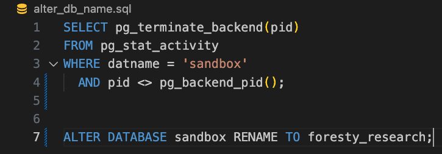

2. **Source data downloaded from FIA and ETH domains**
[FIA DataMart](https://research.fs.usda.gov/products/dataandtools/fia-datamart) | [ETH Zurich](https://prs.igp.ethz.ch/research/completed_projects/automated_large-scale_high_carbon_stock.html)

3. **Raw data files used to create dataframes in Pandas**
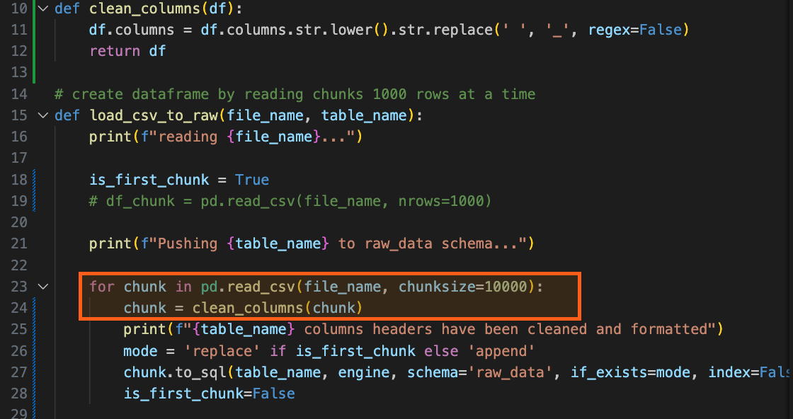

4. **Pandas used to drop and/or alter column names**
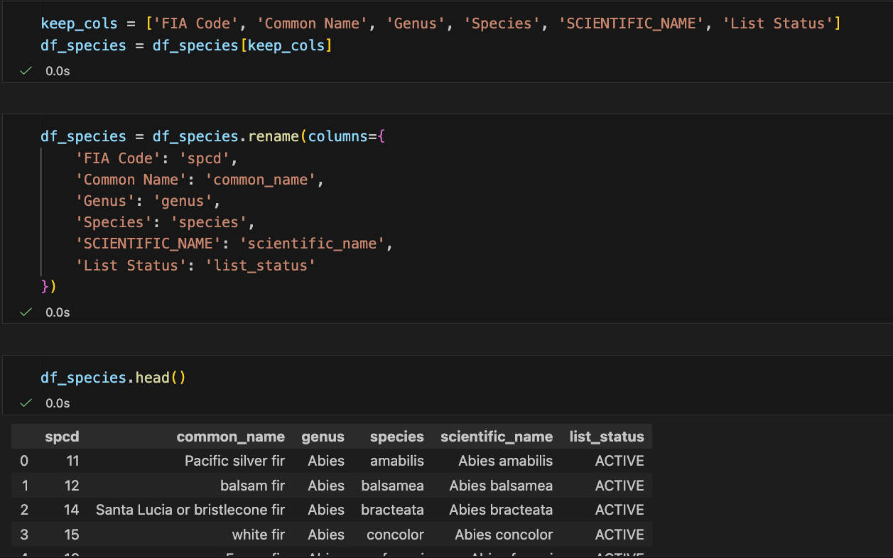

5. **SQLalchemy initializes the engine and loads the dataset**
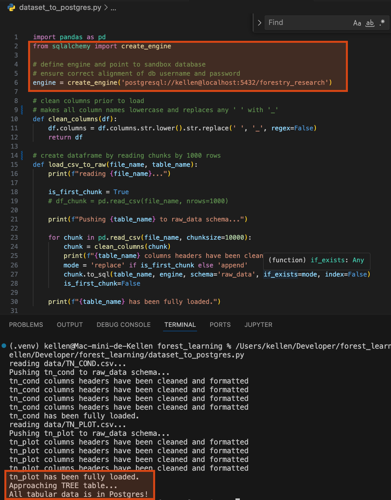
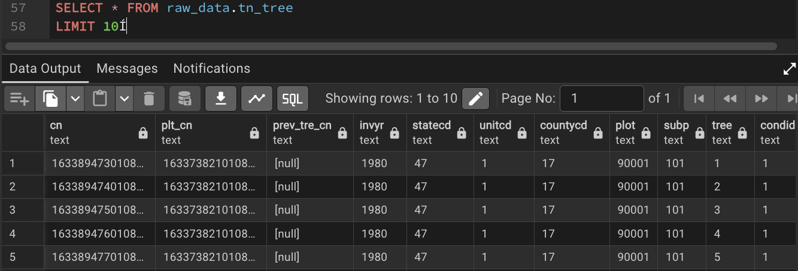

6. **Terminal command used to import 4 .tif files**
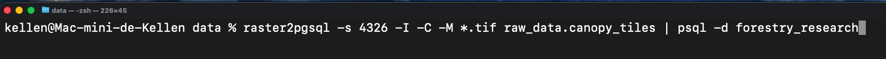

7. **PostGIS extension and indexing**

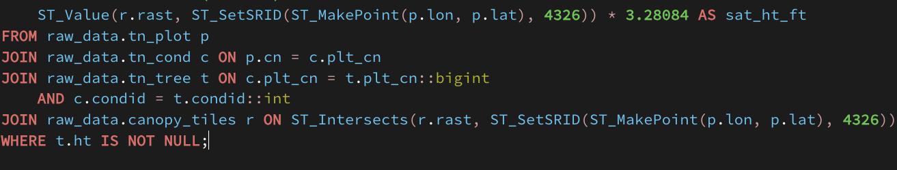
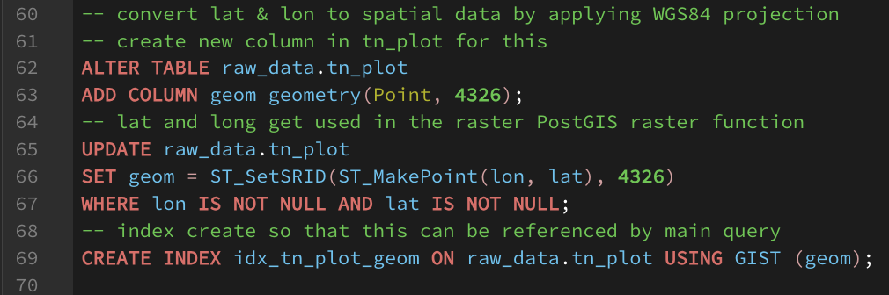

8. **Create ML schema**

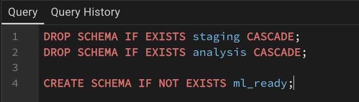

9. **Joins and SQL logic for ML ingestion**
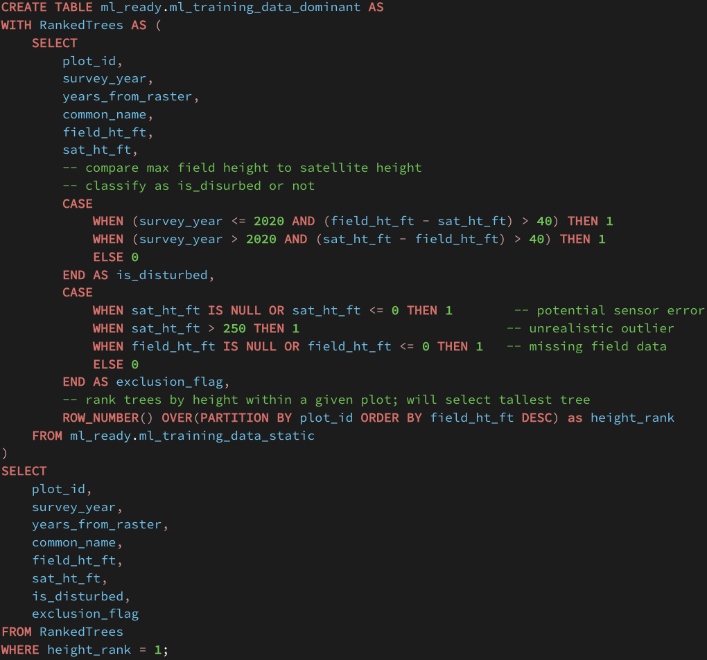

### **Database Schema Preview**
| Overview Schema | ML Ready Schema | Raw Data Schema |
| :---: | :---: | :---: |
| 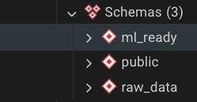 | 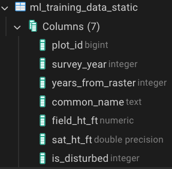 | 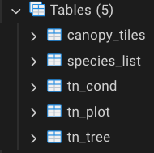 |

---

## Roadblocks & Solutions

| Roadblock | Resolution |
| --- | --- |
| **Case-Sensitivity Errors:** Postgres failed on uppercase CSV headers (e.g., `"CONDID"`). | Developed a dynamic SQL script to batch-rename all columns to lowercase. |
| **Data Type Mismatches:** Integer columns containing numbers as strings like `"972.0"`. | Casted across datatypes on multiple fieldes process account for decimals during ETL. |
| **Query Performance:** At first, joining the tabular and raster data caused the query to timeout before completion. | Created **GIST Spatial Indexes** on the plot geometries and so that it would no longer need to scan full table to find each row. |
| **Time Discrepancies:** Comparing 1980 field survey data to 2020 satellite imagery. | Filtered dataset for `invyr >= 2015` and added a QA flagging system. |
| **Species Code Meaning:** Attempting to answer questions about the data was complicated by the species codes being only numeric. | Downloaded, cleaned, and integrated the species reference list to the schema. | 
| **Satellite Canopy Height vs Understory:** I became concered about the 'sat_ht_ft' value being applied to such a wide number of trees in a given plot. Upon investigating, it sounds like a common issue when relying on 10-m LiDAR resolution in forestry research. Telling the ML model that a slew of trees measured at 15 feet in the field produced a satellite height measuremnt of 70 feet is liable to confuse the model as these are more or less false positives. | Made the executive decision to rank tree height within each plot. This shrinks the total record count dramaticallly - from approximately 340k records to just over 10,000. I'd rather feed the model meaningful, high-value data than overwhelm it with noise. | 

* a data dictionary of sorts that simply guides users through the meaning/content of a given table or record would be handy |
* perhaps 7 years of forest growth is considered too much time. Should I have limited the survey history further?
* some thoughts on pre-raster tabular data (2015-2019, sweetspot (2020), and post-raster 2021-2022)

---

## Data Quality Assurance

This analysis encounted a crossroads of sorts when it came time to decide whether or not it would be worth injecting every individual tree surveyed in a given plot or to keying on the taller (or tallest) trees that would've been registed in the remote sensing data. The SQL was revised so that a ranking system was applied to each tree (by plot_id) of the entire cleaned dataset. This enabled me to make a comparisson of field to raster data with much more truth while avoiding the noise of several hundred thousand trees whose data are not reflected in the LiDAR data. 

To acheive this, I implemented a quality check, embedded as a CASE statement, that dynamically flags records to ensure the ML model only trains on high-integrity data as well as classifiying those records as "stable" or "disturbed". The ranking was handled by moving this logic inside of a CTE then selecting and filtering based on that logged data.

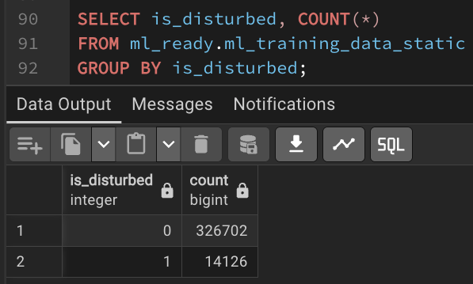

While reviewing the output, I noticed a several thousand NULL values in field_ht_ft.  

I thought that perhaps these would be localized to a specific area or 
maybe belong to a particular species. Even with further investigation, no real pattern stood out. This could simply be representation in the dataset of how difficult
collecting field data can be.

This was a critical catch as nearly 8% of all records in the ml_training_data_static table had a null field height measurement value. This would've caused the ML model to error as models can't train on empty targets. 

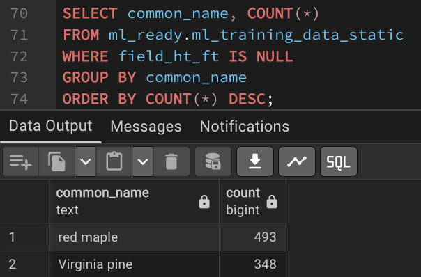

---

## 🚀 Getting Started

1. Clone the repo.
2. Ensure PostGIS is enabled on your local database.
3. Run `etl_scripts/01_import_species.py` to populate the reference table.
4. Execute the SQL views found in `sql/v_gold_ml_ready.sql`.