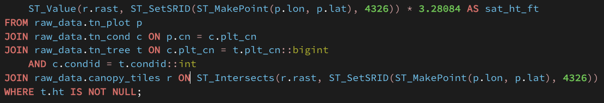
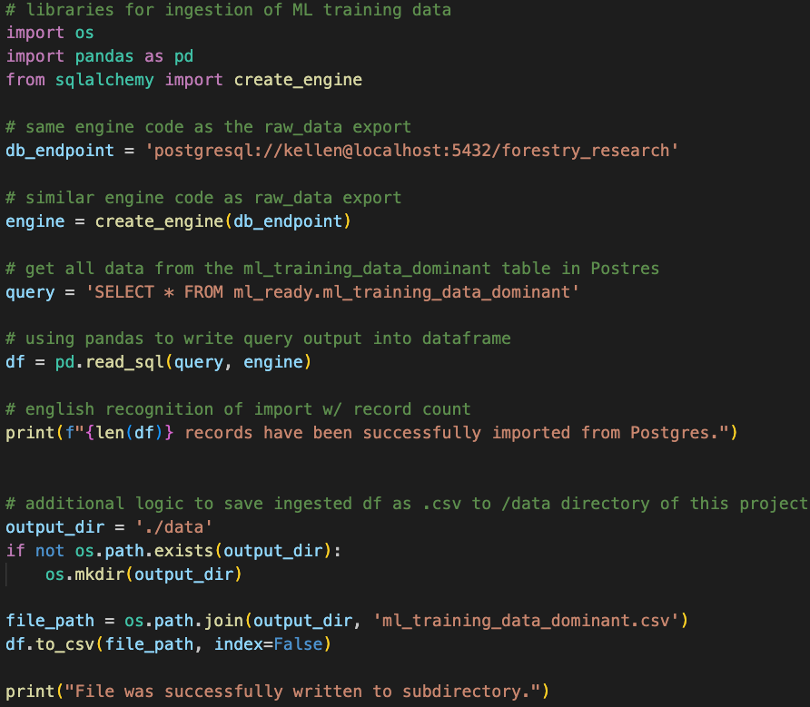
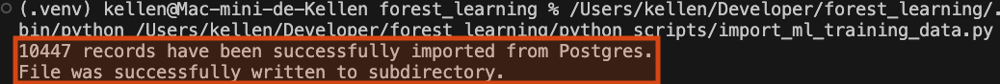
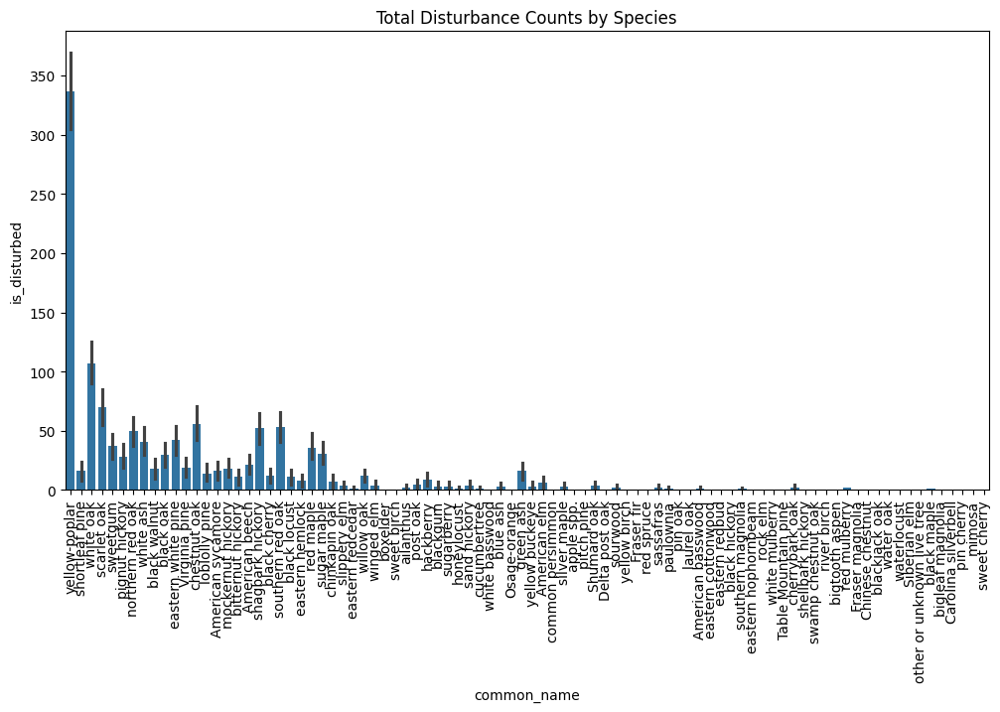
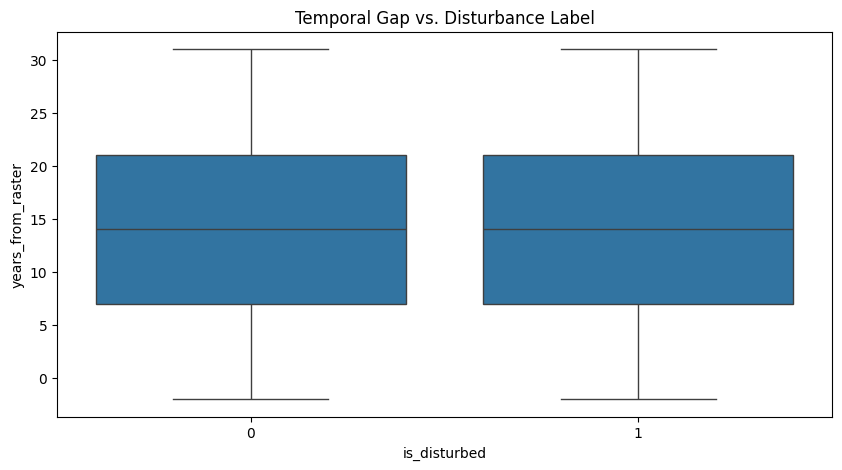
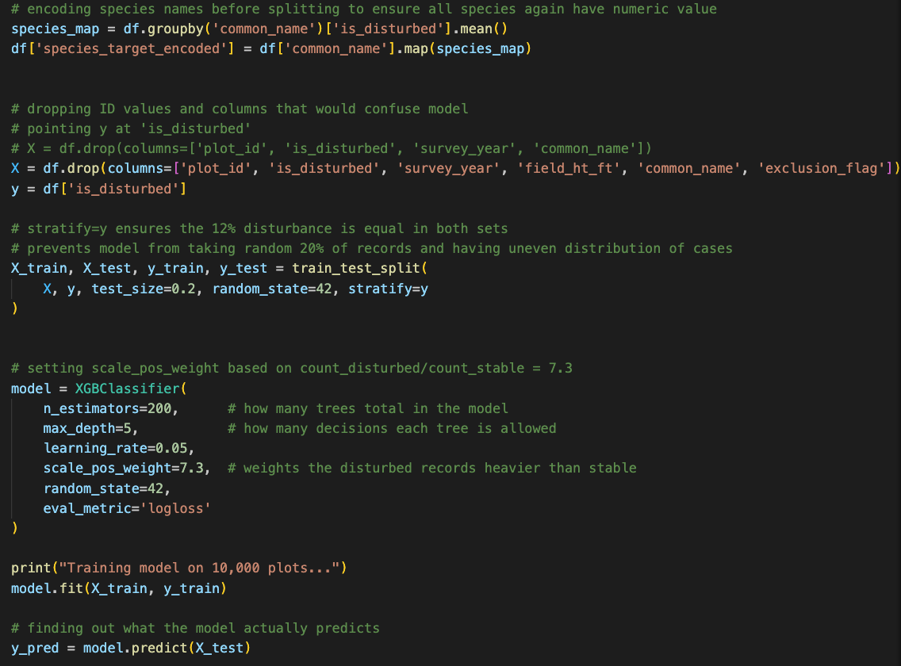
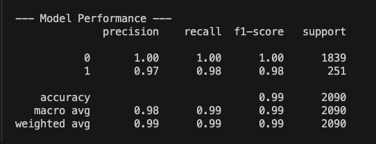
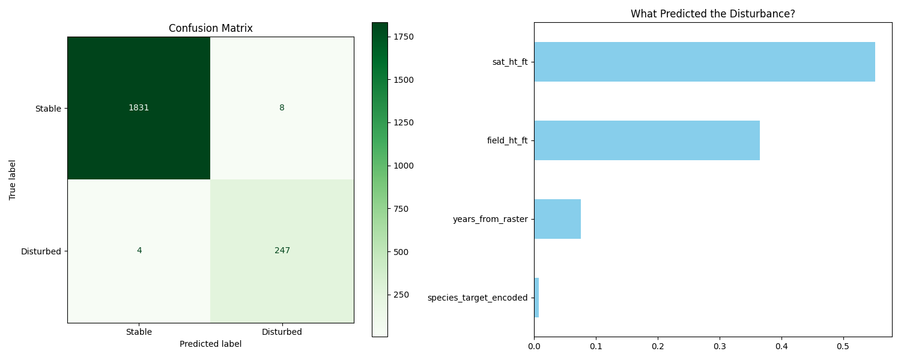
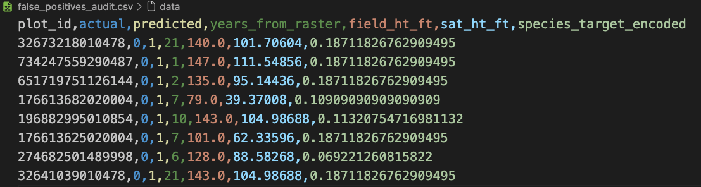
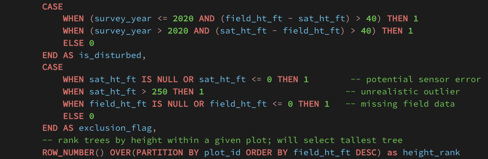

# Tennessee Forest Canopy Height: Leveraging LiDAR and Field Inventory Analysis Data to Predict Disturbance.

> **Objective:** Create compatibility between ground survey forest data and satellite canopy height rasters to fuel a robust, ML-ready dataset for predictive modeling. The model, built on XGBoost framework,  aims to identify forest disturbances that could suggest hyper-localized storm damage, undocumented deforestation, or effects of invasive beetle species. 

---

## Overview

This project addresses the gap between ground-level forestry inventory and satellite canopy height models. By joining thousands of tree measurements captured in the field with spatial rasters, a reliable model to predict forest structure in Tennessee can be built. 

Tabular data was obtained from the Forest Inventory and Analysis DataMart provided by the U.S. Department of Agriculture. Information regarding the plot of land, condition of the land, and field surveys of trees were of particular interest to this query. Three applicable tables were downloaded from the FIA DataMart. A fourth table, containing the master list of tree species, would later be included from the same source. That raw data can be found here: [FIA DataMart](https://research.fs.usda.gov/products/dataandtools/fia-datamart)

To make a comparison to remote sensing data and demonstrate competency working with raster data, canopy height measurements captured with LiDAR instrumentation at a resolution of 10-m were sourced to then be combined with the tabular data from Tennessee forests. The canopy height data was compiled by EcoVision Lab at the ETH Zurich. The following link offers further details on their research and access to the datasets: [ETH Zurich](https://prs.igp.ethz.ch/research/completed_projects/automated_large-scale_high_carbon_stock.html)

The Data Pipeline & Architecture section found below details the steps used to clean and store raw data, transform it into a model-ready format, design of the machine learning model, and analysis of the model's results. 

An actionable audit list of `plot_id` values associated with false positives was stored automatically by the script.

---

## Tech Stack & Libraries

### **Database & GIS**
* **PostgreSQL / PostGIS:** Used for spatial joins, coordinate transformations, and data indexing.
* **pgAdmin 4:** Database management and query visualization.

### **Python Libraries**
* `pandas`: Data manipulation and ingestion of .csv/.xlsx files
* `sqlalchemy`: Postgres database connection and ETL.
* `XGBoost` / `Scikit-Learn`: Predictive modeling
* `matplotlib` / `seaborn`: EDA and visualization tools.

---

## Data Pipeline & Architecture

  <h3>1. New database and schema created in PostgreSQL</h3>
  

  <h3>2. Source data downloaded from FIA and ETH domains</h3>
  <ul>
    <li><a href="https://research.fs.usda.gov/products/dataandtools/fia-datamart">FIA DataMart</a></li>
    <li><a href="https://prs.igp.ethz.ch/research/completed_projects/automated_large-scale_high_carbon_stock.html">ETH Zurich</a></li>
  </ul>

  <h3>3. Raw data files cleaned and used to create dataframes in Pandas</h3>
  

  <h3>4. Pandas used to drop and/or alter column names</h3>
  

  <h3>5. SQLAlchemy initializes engine and begins to load dataset</h3>
  
  

 

  <h3>6. Terminal command used to import all .tif files</h3>
  

  <h3>7. PostGIS extension and indexing</h3>
  <table style="width: 100%; border-collapse: collapse;">
    <tr style="border: none;">
      <th style="text-align: center; border: none;">Raster-specific Extension</th>
      <th style="text-align: center; border: none;">Transform Raster</th>
      <th style="text-align: center; border: none;">Index Geometry</th>
    </tr>
    <tr style="border: none;">
      <td style="width: 33%; border: none;"></td>
      <td style="width: 33%; border: none;"></td>
      <td style="width: 33%; border: none;"></td>
    </tr>
  </table>

  <h3>8. Create ML schema</h3>
  

  <h3>9. Joins and SQL logic for ML table creation</h3>
  

  <h3>10. Reconnect to PostgreSQL for ML Table Ingestion</h3>
  
  

  <h3>11. EDA for proof of concept prior to ML run</h3>
  <table style="width: 100%; border-collapse: collapse;">
    <tr style="border: none;">
      <th style="text-align: center; border: none;">Species Count</th>
      <th style="text-align: center; border: none;">Time Gap Analysis</th>
    </tr>
    <tr style="border: none;">
      <td style="width: 50%; border: none;">
        
      </td>
      <td style="width: 50%; border: none;">
        
      </td>
    </tr>
  </table>

  <h3>12. XGBoost model and performance</h3>
  <table style="width: 100%; border-collapse: collapse;">
    <tr style="border: none;">
      <th style="text-align: center; border: none;">Meat of model</th>
      <th style="text-align: center; border: none;">Performance stats</th>
    </tr>
    <tr style="border: none;">
      <td style="width: 50%; border: none;">
        
      </td>
      <td style="width: 50%; border: none;">
        
      </td>
    </tr>
  </table>

  <h3>13. Importance of features to the model</h3>
  

  <h3>14. Actionable list of false positives</h3>
  

### **Database Schema Preview**
| Overview Schema | ML Ready Schema | Raw Data Schema |
| :---: | :---: | :---: |
|  |  |  |

---

## Roadblocks & Solutions

| Roadblock | Resolution |
| --- | --- |
| **Case-Sensitivity Errors:** Postgres failed on uppercase CSV headers (e.g., `"CONDID"`). | Developed a dynamic SQL script to batch-rename all columns to lowercase. |
| **Data Type Mismatches:** Integer columns containing numbers as strings like `"972.0"`. | Casted across datatypes on multiple fields during the ETL process to account for decimals. |
| **Query Performance:** At first, joining the tabular and raster data caused the query to timeout before completion. | Created **GIST Spatial Indexes** on the plot geometries so that it would no longer need to scan full table to find each row. |
| **Time Discrepancies:** Comparing 1980 field survey data to 2020 satellite imagery. | Filtered dataset for `invyr >= 2015` and added a QA flagging system. |
| **Species Code Meaning:** Attempting to answer questions about the data was complicated by the species codes being only numeric. | Downloaded, cleaned, and integrated the species reference list to the schema to introduce the field `common_name` | 
| **Satellite Canopy Height vs Understory:** I became concerned about the `sat_ht_ft` value being applied to such a wide number of trees in a given plot. Upon investigating, it sounds like a common issue when relying on 10-m LiDAR resolution in forestry research. Telling the ML model that a slew of trees measured at 15 feet in the field produced a satellite height measurement of 70 feet is liable to confuse the model. | Made the executive decision to rank tree height within each plot. This shrinks the total record count dramatically - from approximately 340k records to just over 10,000. I'd rather feed the model meaningful, high-value data than overwhelm it with noise. | 
| **Give the Model a Sense of Time:** The raw data includes snapshots in time by displaying the field survey year and we know that the raster data came from 2020. This isn't enough for a machine learning model to consider the passage of time in its decision tree. | Calculated an additional column that outputs the number of years on either side of the remote sensing that the field survey was conducted. |
| **Recall and Precision Suspiciously High:** Feeding the `ml_training_data_dominant` table to the model as-is resulted in precision and recall metrics of 97% and 98%, respectively. This was too good to be true. After looking into this, providing the math of what constitutes "is_disturbed" to the model was essentially providing it a cheat sheet and encouraging it to calculate what was already categorized by the CASE statements. | Modified the model by removing `field_ht_ft` and `exclusion_flag` columns from its training set. Decrease in precision and recall scores show that model is learning from patterns instead of memorizing the categorization of disturbed vs. stable as defined by the SQL logic.| 

---

## Data Quality Assurance

While reviewing the initial SQL output, I noticed several thousand NULL values in `field_ht_ft`.  

I thought that perhaps these would be localized to a specific area or 
maybe belong to a particular species. Even with further investigation, no real pattern stood out. This could simply be a representation in the dataset of how difficult
collecting field data can be.

This was a critical catch as nearly 8% of all records in the `ml_training_data_static` table had a null field height measurement value. This would've caused the ML model to error as models can't train on empty targets. 

  <h3>NULL Field Height Issue</h3>
  

The greatest roadblock dealt with the fact that the raster canopy height measurement really only measures the peak of that `plot_id`. Feeding ~300k understory trees assigned the same satellite height value would not serve the model well. As such, the SQL logic was revised so that a ranking was applied to each tree grouped by `plot_id`. This enabled the comparison of field to raster data with much more truth while avoiding the noise of several hundred thousand trees whose height measurements are not reflected in the LiDAR data. 

To achieve this, I implemented a quality check, embedded as a CASE statement, that dynamically flags records to ensure the ML model is shielded from records with sensor errors or data skewed by environmental factors such as cloud opacity. A separate CASE statement categorizes records as "stable" or "disturbed". The ranking was handled by moving this logic inside of a CTE then selecting and filtering based on that stored data.

  <h3>Supply Only High-Integrity Data</h3>
  

It was also necessary to give the model a bit of context for the passage of time. This could be described as feature engineering in a data science role. The output table does have the survey year included. However, without a calculation of that value with respect to the year in which the raster data was compiled, the model wouldn't know to use time as part of its prediction. This is a key ingredient to the whole process.

  <h3>Years Until or Since LiDAR Imaging</h3>
  

---
## Conclusion

  <h3>1. Findings:</h3>

166 false positives identified from the model execution.  
Precision = 57%  
Recall = 87%  
F1-score = 79%   
`sat_ht_ft` field identified as most important feature to the model.

  <h3>2. Significance:</h3>

The model succeeded in what it set out to do considering the parameters it was fed. The false positives list found in the audit file provides the forestry team with cause to further investigate those specific areas instead of flying a drone or walking each of the ~2100 plots from the test split data. While some of the records categorized as disturbances will be edge cases outside of the 40 ft variance stipulated by the SQL logic, it's possible that this list captures incidences of hyper-localized storms, illegal deforestation, or some unknown pest that toppled trees. 

  <h3>3. Room for improvement:</h3> 

Some of the common_name values contain spaces or different joining characters. The species reference list was integrated later in the process and I was sure to format the field names accordingly, but should've reviewed and synchronized the values within as well. 

It would be interesting to include other variables such as elevation and slope to see how they affect the prediction. A true species susceptibility feature would be very handy to introduce as opposed to the model inferring and assigning a lightly-weighted variable. I'd also like to work with spectral signatures someday as it stands to reason that the color aspect of satellite images could prove to be extremely useful in such analyses. 

Being able to rely on domain knowledge regarding expected forest growth rates would help to potentially narrow the time gap between field data and the raster image. Perhaps the industry would consider 5 years on either side of the 2020 satellite data to be too much time for the model to parse. 

Additional code could be included to illustrate species counts. If the audit log of false positives shows a high incidence of a particular species, it may be worth removing them from the training data as a flagged exclusion. Adding exclusions based on conclusions drawn from the false positives list would improve recall. 

---

## Data Dictionary 

Table Name | Field Name | Data Type | Description |
| :--- | :--- | :--- | :--- |
| **tn_plot** | `geom` | `GEOMETRY(Point, 4326)` | Spatial point object containing longitude and latitude. |
| **canopy_tiles** | `rast` | `RASTER` | 10m resolution LiDAR canopy height data stored in .tif tiles. |
| **species_list** | `common_name` | `VARCHAR` | The common name for the tree species. |
| **ml_training_data_dominant** | `plot_id` | `INT` | Unique identifier for the forest plot. |
| **ml_training_data_dominant** | `field_ht_ft` | `NUMERIC` | Tree height measured by ground crews in feet. |
| **ml_training_data_dominant** | `sat_ht_ft` | `NUMERIC` | Canopy height derived from LiDAR raster via `ST_Value` join. |
| **ml_training_data_dominant** | `years_from_raster` | `INT` | Delta between ground survey year and 2020 satellite capture. |
| **ml_training_data_dominant** | `is_disturbed` | `BOOLEAN` | Target variable: True if field vs. satellite variance > 40ft. |
| **ml_training_data_dominant** | `exclusion_flag` | `INT` | 1 = Row flagged for sensor error/outlier; 0 = High integrity. |
