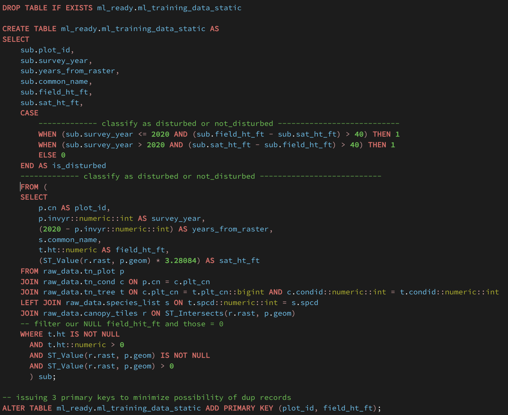

# Tennessee Forest Canopy Height: Spatial and Tabular ETL to Feed Machine Learning Model

> **Project Objective:** Create compatibility between ground survey forest data and satellite canopy height rasters to fuel a robust, ML-ready dataset for biomass modeling. We want the model to identify potential beetle killoffs, storm damage, or even illegal deforestation.

---

## Overview

This project addresses the gap between ground-level forestry inventory and high-resolution satellite height models. By joining thousands of tree-level measurements with spatial rasters, we are building a model to predict forest structure across the state of Tennessee. 

Sourcing and storing the raw data was critical to provide a solid foundation prior to performing any type of analysis. A database was created in PostgresSQL to house this information.

Tabular data was obtained from the Forest Inventory and Analysis DataMart provided by the U.S. Department of Agriculture. Information regarding the plot of land, condition of the land, and field surveys of trees were of particular interest to this query, so three applicable tables were downloaded from the FIA DataMart. A fourth table, containing the master list of tree species, would later be included from the same source. That raw data can be found here: [FIA DataMart](https://research.fs.usda.gov/products/dataandtools/fia-datamart)

To make a comparrison to remote sensing data and demonstrate competency working with raster data, canopy height measurements captured with LiDAR instrumentation at a resolution of 10-m were sourced to then be combined with our tabular data on Tennessee forests. The canopy height data was compiled by EcoVision Lab at the ETH Zurich. The following link offers further details on their research and access to the datasets: [ETH Zurich](https://prs.igp.ethz.ch/research/completed_projects/automated_large-scale_high_carbon_stock.html)

The sourced data was cleaned using Python (Pandas) and imported to Postgres via a separate Python script built on SQLalchemy.

The raw data in PostgreSQL was then passed through Postgis extenstion so that raster data could be pinned to the existing tabular data. 

With the remote sensing data now aligned with the field survey information, query logic was used to build a table that will fuel our machine learning algorithm. The key to doing this calculating an additional field that compares survey dates to raster imaging dates. This will enable the model to make decisions based on available parameters across time.

---

##  Tech Stack & Libraries

### **Database & GIS**

* **PostgreSQL / PostGIS:** Used for spatial joins, coordinate transformations, and data indexing.
* **pgAdmin 4:** Database management and query visualization.

### **Python Libraries**

* `pandas`: Data manipulation and ingestion of .csv/.xslx files
* `sqlalchemy`: Postgres database connection and ETL.
* `XGBoost` / `Scikit-Learn`: (Planned) For predictive modeling.

---

## Data Pipeline & Architecture

1. New database and schema to store all data created in PostgresSQL

2. Source data downloaded from FIA and ETH web domains  
[FIA DataMart](https://research.fs.usda.gov/products/dataandtools/fia-datamart)  
[ETH Zurich](https://prs.igp.ethz.ch/research/completed_projects/automated_large-scale_high_carbon_stock.html)

3. Raw data files used to create dataframes in Pandas

4. Pandas used to drop and/or alter column names

5. SQLalchemy intializes the engine and connection for load of cleaned dataframes into database

6. Terminal command used to import 4 .tif files of LiDAR tile images into database as one unit - no spatial joins required

7. PostGIS extension used to manipulate raster data and create index usable for querying 

8. Create machine learning schema where only data to be used in the ML model will be stored

9. Joins and SQL logic used to create views ready for ML ingestion

### **Database Schema Preview**
| Overview Schema | ML Ready Schema | Raw Data Schema |
| :---: | :---: | :---: |
|  |  |  |

---

## Roadblocks & Solutions

| Roadblock | Resolution |
| --- | --- |
| **Case-Sensitivity Errors:** Postgres failing on uppercase CSV headers (e.g., `"CONDID"`). | Developed a dynamic SQL script to batch-rename all columns to lowercase. |
| **Data Type Mismatches:** Integer columns containing strings like `"972.0"`. | Implemented a two-step casting process: `::numeric::int` to strip decimals during ETL. |
| **Query Performance:** Spatial joins taking minutes to return only a few rows. | Created **GIST Spatial Indexes** on the plot geometries and raster convex hulls. |
| **Temporal Discrepancy:** Comparing 1980s ground data to 2020 satellite imagery. | Filtered dataset for `invyr >= 2015` and added a QA flagging system. |
| fought through a lot of datatypes conversions e.g. numeric vs integer, string vs numeric, etc. 
| a data dictionary of sorts that simply guides users through the meaning/content of a given table or record would be handy
| could've investigated the NULL field_ht_ft values further...were they concentrated in one area or possibly for a certain species of tree? 
| perhaps 7 years of forest growth is considered too much time. Should I have limited the survey history further?
| some thoughts on pre-raster tabular data (2015-2019, sweetspot (2020), and post-raster 2021-2022)
| something else I'd do differently; include actual names form the beginning. Making sense of the species codes was difficult. The task become a lot clearer once tree species names were mapped. 
---

## Data Quality Assurance

Implemented a dynamic flagging system to ensure the ML model only trains on high-integrity data as well as classifiying records into "stable" or "disturbed". This distinction will be key to the ML model. Instead of looking at the vast majority of Tennessee trees and predicting height based on a regression model, it is more interesting to work with the would-be outliers in an attempt to identify areas that display significant disturbance. This was done inside of the case statement within the create_ML_ready_table query. 

While reviewing the output, I noticed a few thousand NULL values in field_ht_ft.  

I thought that perhaps these would be localized to a specific area or 
maybe belong to a particular species. Even with further investigation, no real pattern was became eveident. This could simply be representation in the dataset of how difficult
collecting field data can be.

This was a critical catch as nearly 8% of all records in the ml_training_data_static table had a null field height measurement value. This would've caused the ML model to error as models can't train on empty targets.

---

## 🚀 Getting Started

1. Clone the repo.
2. Ensure PostGIS is enabled on your local database.
3. Run `etl_scripts/01_import_species.py` to populate the reference table.
4. Execute the SQL views found in `sql/v_gold_ml_ready.sql`.

---

### Pro-Tips for your Screenshots:

* **The "Hero" Shot:** Take a screenshot of your `v_gold_ml_ready` view in pgAdmin showing the `tree_name`, `field_ht_ft`, and `sat_ht_ft` side-by-side.
* **Performance:** Include a screenshot of the "Query Tool" message showing the `0.8s` execution time to prove your optimization work!

